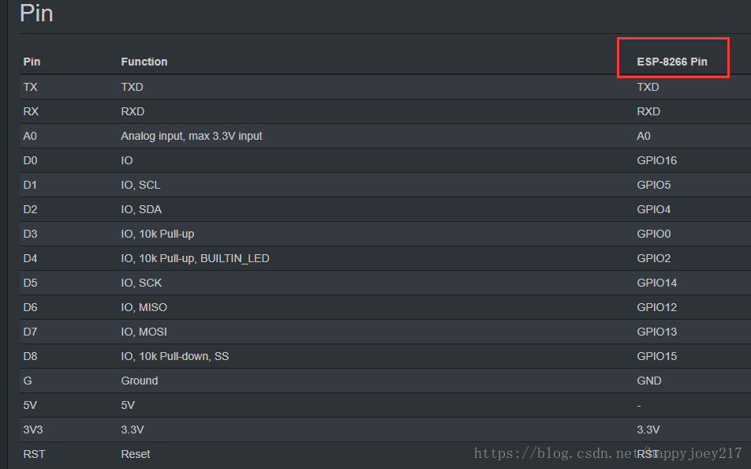

# 针对ESP系列IOT芯片的家电远程控制固件

## 启动流程
```
启动读取EEPROM中的wifi数据，尝试连接wifi -> 成功则开启控制服务器
            |
            V
失败则开启AP服务(ap_of_esp)，并开启连接服务器 -> 通过连接服务器写入wifi信息
                                            |
                                            V
                            重新启动  <- 存入EEPROM 
```

---

## 引脚定义(wemos_d1_mini)
- pin2 -> D4: switch led : /switch/
- pin4 -> D2: power : /power/
- pin0 -> D3: mode : /mode/
- pin12 -> D6: brighter : /up/
- pin13 ->D7: darker : /down/
  


---

## 包说明
1. remote-controller-arduino.ino'
  - 主程序，负责启动初始化和循环处理请求
2. AccessPointHandler.ino
  - 负责开启默认热点
3. ControlWebServer.ino
  - 负责设置和启动服务器
  - 服务器暴露多条接口，可用于设备设置和设备控制
4. DataHandler.ino
  - 用于操控板上EEPROM，实现配置信息的存储和读取
5. PinHandler.ino
  - 用于操控对应串口，可基于需求进行修改
6. WiFiConnecter.ino
  - 用于连接WiFi信号
  - WiFi配置信息可通过DataHandler从EEPROM中读取